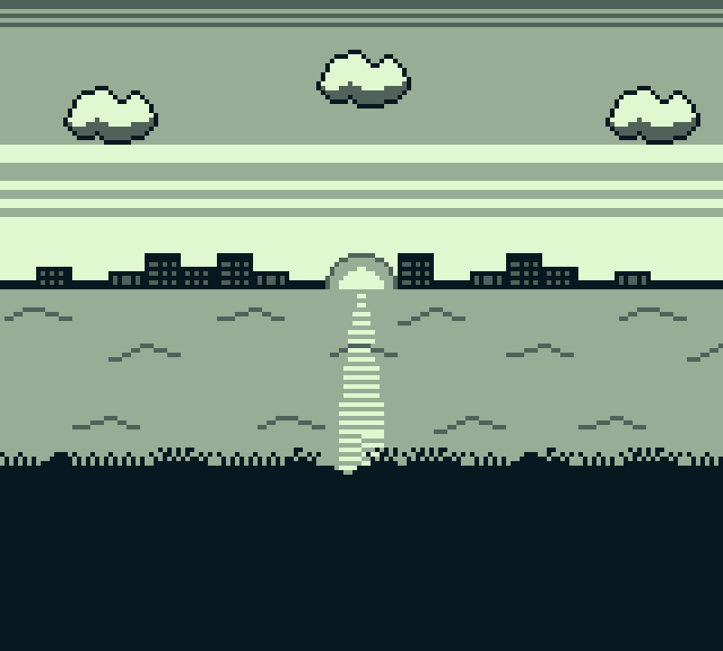

# Fairylake

The Fairylake Test comes closer to a demo than a proper test ROM. It utilizes a majority of features the Gameboy Graphics System has to offer.

**Note:** This test is currently WIP. Expect major changes.

## Verified on:

* ✔ Gameboy Pocket (MGB 9638 D)
* ✔ Gameboy Color (CPU CGB D)

## Expected Output

## ROM Behavior

* **Scanlines 0 - 7:** Static background. No scrolling, no sprites.

* **Scanlines 8 - 31:** "Cloud-layer", background tiles with SCX incremented every 7 VBlanks.
* **Scanlines 32 - 47:** *(not yet implemented)* "Heatlines", mid-scanline modification of SCY causing a "wiggle" effect going up and down
* **Scanlines 48 - 63:** Static background, no scrolling. Sun made up of 2 sprites, both with the same tile number, utilizing X-flip.
* **Scanlines 64 - 71:** *(not yet implemented)* "Slow water", slow increments of SCX
* **Scanlines 72 - 87:** *(not yet implemented)* "Mid water", slightly faster increments of SCX
* **Scanlines 88 - 95:** *(not yet implemented)* "Fast water", even faster increments of SCX
* **Scanlines 96 - 103:** "Grass", utilizing Window display
* **Scanlines 104 and following:** Static background. No scrolling, no sprites, no windows.