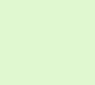
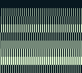

# LYCSCY

The LYCSCY is intended to test basic functionality of SCY and LY=LYC STAT interrupts. It fills each row of tiles of the background with a different tile and changes SCY every 8 scanlines using LY=LYC interrupts.

# Verified on:

* ✔ Gameboy Pocket (MGB 9638 D)
* ✔ Gameboy Color (CPU CGB D)

## Minimum Requirements

* **CPU:**
  * Functional Instructions
  * Basic Instruction Timing
  * Memory Access Timing **not** required
* **Interrupts:**
  * VBlank Interrupt
  * LYC=LY STAT Interrupt
* **PPU:**
  * LCDC Bits 0, 4 and 7
  * Functional LY Register
  * Functional Background Display
  * Vertical Scrolling (SCY Register)

## Expected Output

## Common Error Outputs

### Broken LY=LYC Interrupts / SCY

This screen may occur if vertical background scrolling doesn't work correctly or LY=LYC interrupts aren't fired (thereby not modifying the SCY register).