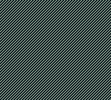
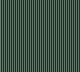
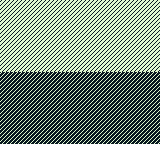

# SCXLY

The SCXLY test is intended to test basic functionality of SCX and STAT/VBlank interrupts. It draws straight, vertical lines onto the screen and sets SCX to the same value as LY for each scanline, creating a "diagonal line" sort of effect.

## Verified on:

* ✔ Gameboy Pocket (MGB 9638 D)
* ✔ Gameboy Color (CPU CGB D)

## Requirements

* **CPU:**
  * Functional Instructions
  * Basic Instruction Timing
  * Memory Access Timing **not** required
* **Interrupts:**
  * VBlank Interrupt
  * HBlank STAT Interrupt
* **PPU:**
  * LCDC Bits 0, 4 and 7
  * Functional LY Register
  * Functional Background Display
  * Functional Background Palette (BGP)
  * Horizontal Scrolling (SCX Register)

## Expected Output

## Common Error Outputs

### Broken HBlank Interrupts / SCX

This screen may occur if background scrolling doesn't work correctly or HBlank interrupts aren't fired (thereby not incrementing the SCX register).

### Incorrect initial BGP state

A screen like this may occur if the BGP register isn't initialized with correct values after startup. The BGP register is changed to what it *should* be after startup on scanline 72.