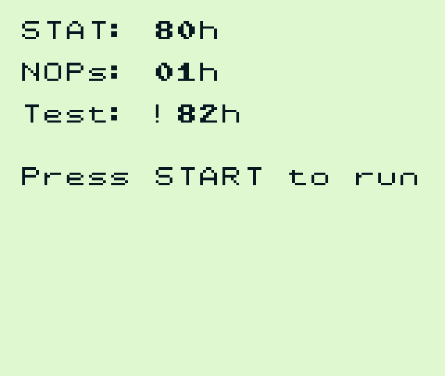
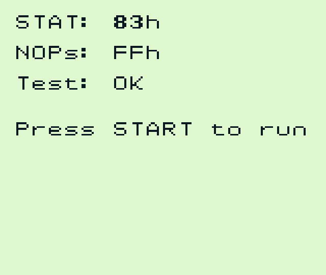
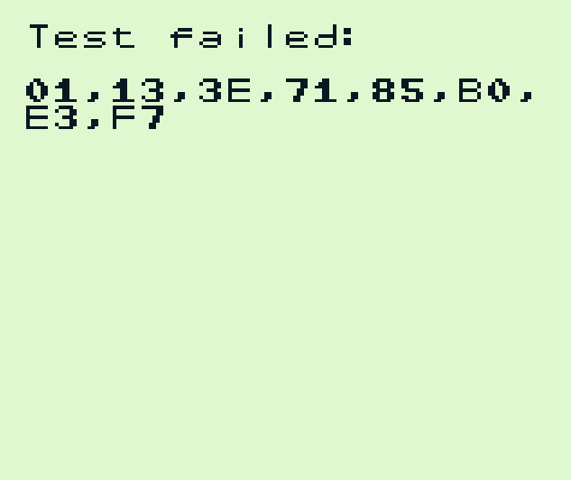
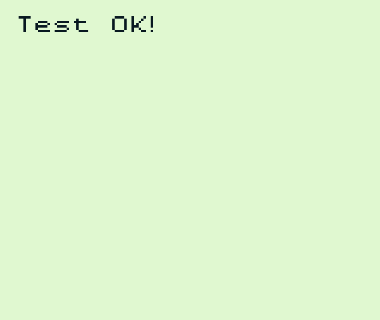

# STATcount

The STATcount ROM is intended as an emulator debugging tool to assist with PPU timings. It allows for running a variable amount of machine cycles (referred to as NOPs) before storing the status of the STAT register.

## Verified on:

* ✔ Gameboy Pocket (MGB 9638 D)
* ✔ Gameboy Color (CPU CGB D)

## Minimum Requirements

* **CPU:**
  * Functional Instructions
  * Accurate Instruction Timing (especially `nop`, `jp hl` and `ld a,[$ff00+c]`)
  * Memory Access Timing **required** (at least for `ld a,[$ff00+c]`)
* **Interrupts:**
  * VBlank Interrupts
* **PPU:**
  * LCDC Bit 7
  * Functional LY Register
  * Functional STAT Register (including bit 7 reading as constant `1`)
  * Accurately timed Mode-loop (including scanline 0 after enabling LCD)
* **Other:**
  * Functional Joypad (not required for `statcount-auto.gb`)
  * Functional WRAM ($C000 - $CFFF)

## Usage

After starting up the ROM the amount of machine cycles to wait can be modified using the Up / Down buttons. The minimum amount of NOPs is 1 (as memory read instructions *should* have a latency before actually reading the value from memory).

Once the desired amount of NOPs has been selected, press START to run the test. LCD will be disabled for a short bit, re-enabled to run the test, disabled again to load VRAM with test results and finally re-enabled to display the results.

The "Test" label will read either `OK` or `!XXh`. If it is not `OK`, the value shown instead of `XX` is what was expected based on the selected amount of NOPs.

### statcount-auto.gb

The STATcount-auto ROM is an automated version of the STATcount test. It iterates over NOP options $01 to $FF and validates the results. If all results match up with the expected values, a "Test OK!" label will show up. If there are errors, a "Test failed:" label will show up, followed by a list of NOP-count options that the tests failed for, formatted as 2-digit hex numbers.

## Screenshots

### statcount.gb

#### Test Failed

#### Test Passed

### statcount-auto.gb

#### Test Failed

#### Test Passed

